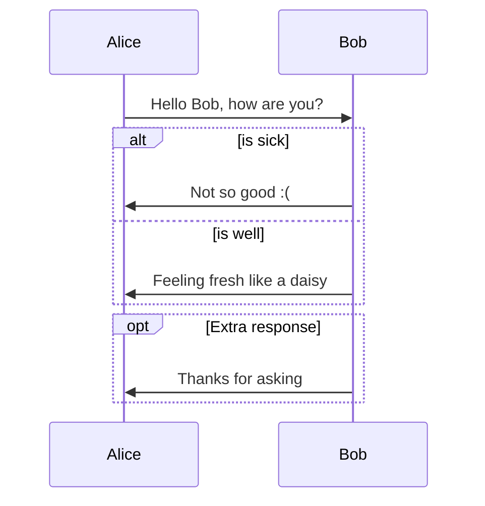
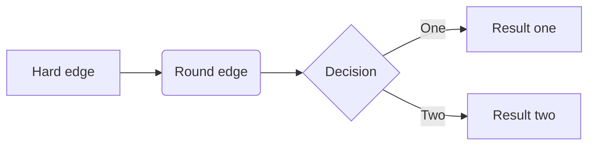
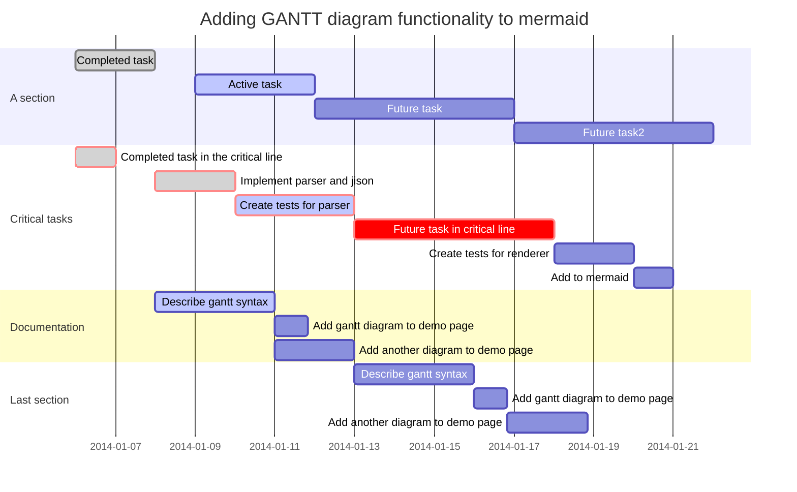
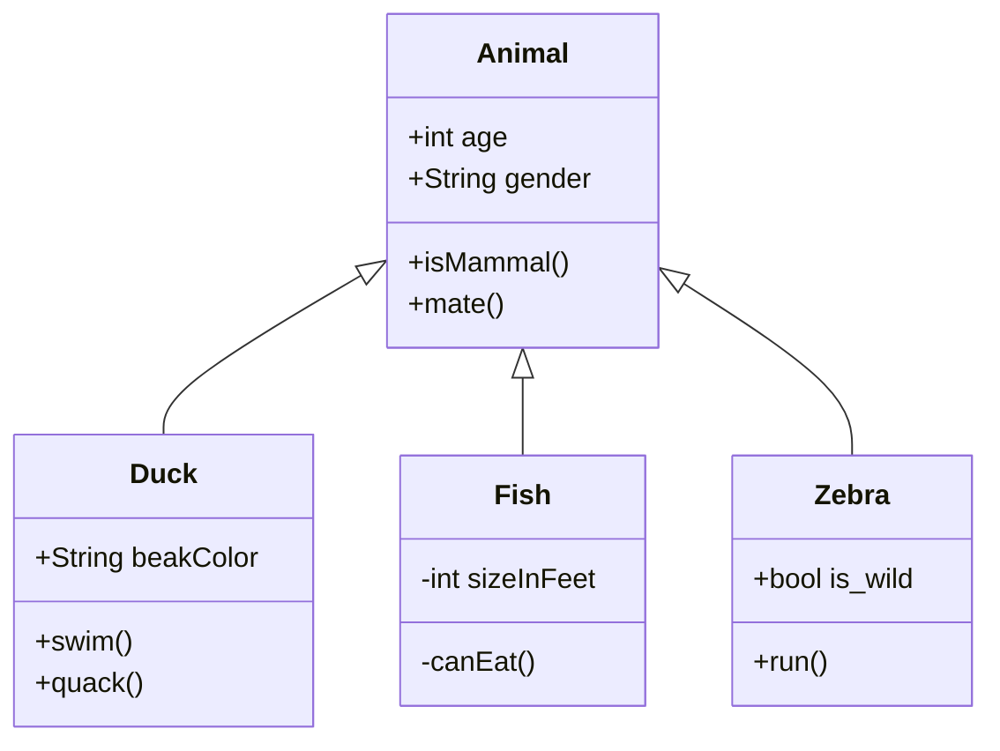
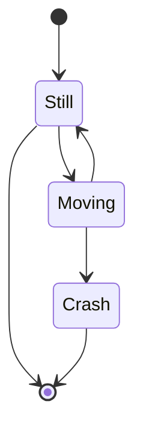
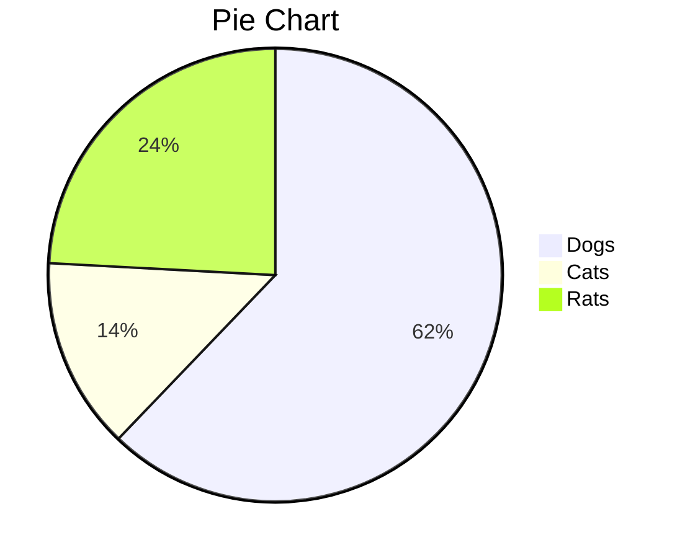
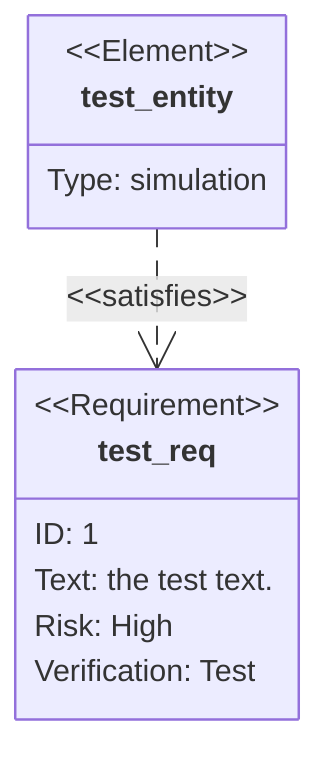
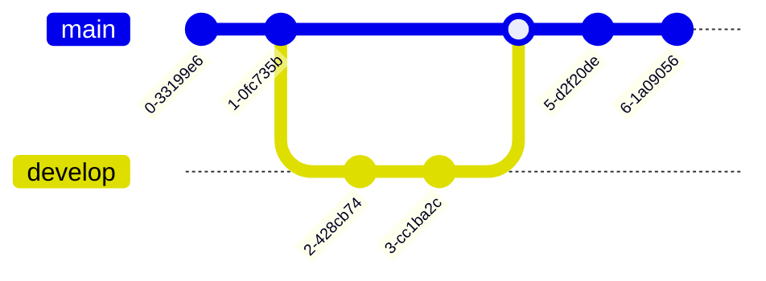
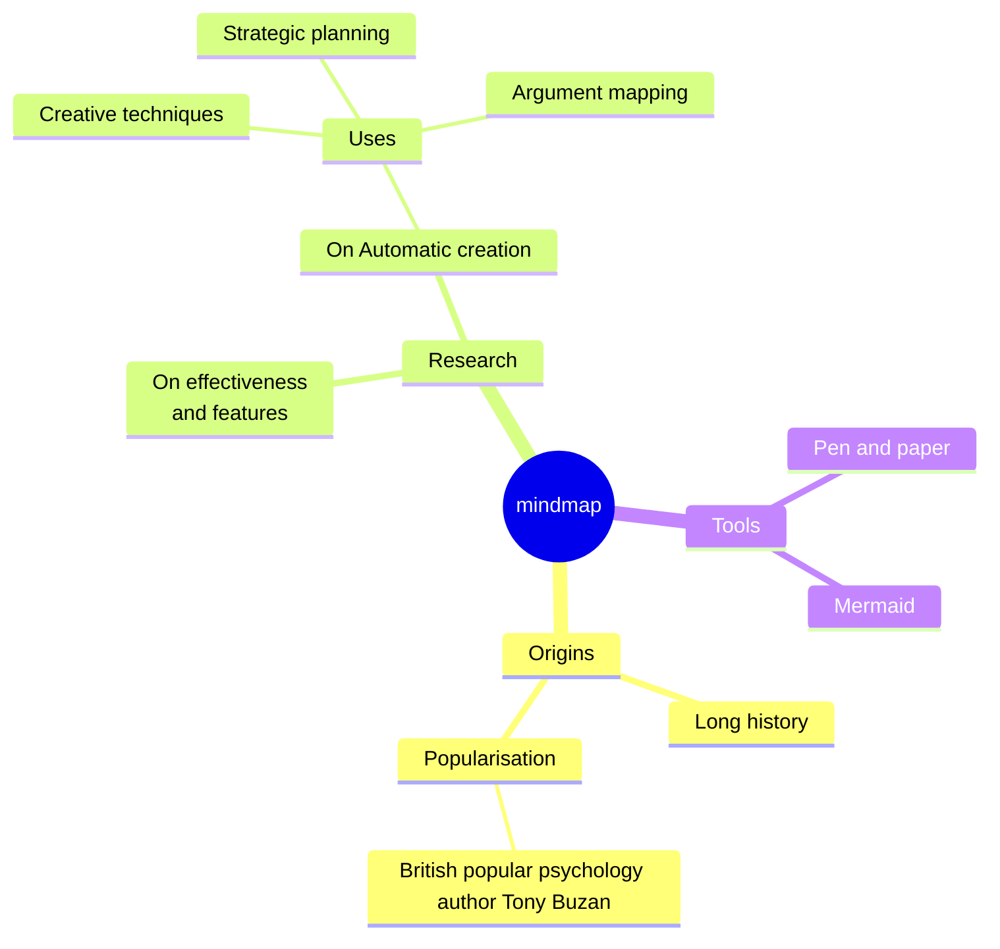

```flow
st=>start: Start
e=>end: End
op1=>operation: My Operation
sub1=>subroutine: My Subroutine
cond=>condition: linear or polynomial ?
io=>inputoutput: catch something...
para=>parallel: 3 possibilities

st->op1->cond
cond(yes, bottom)->io->e
cond(no, right)->sub1(right)
sub1(right)->para
para(path1, top)->cond
para(path2, right)->op1
para(path3, bottom)->e

```


```sequence
Alice->Bob: Hello Bob, how are you?
Note right of Bob: Bob thinks
Bob-->Alice: I am good thanks!
```
```flow
st=>start: Start
op=>operation: Your Operation
cond=>condition: Yes or No?
e=>end

st->op->cond
cond(yes)->e
cond(no)->op
```
















```flow
st=>start: Start|past:>http://www.google.com[blank]
e=>end: Ende|future:>http://www.google.com
op1=>operation: My Operation|past
op2=>operation: Stuff|current
sub1=>subroutine: My Subroutine|invalid
cond=>condition: Yes 
or No?|approved:>http://www.google.com
c2=>condition: Good idea|rejected
io=>inputoutput: catch something...|future

st->op1(right)->cond
cond(yes, right)->c2
cond(no)->sub1(left)->op1
c2(yes)->io->e
c2(no)->op2->e
```

