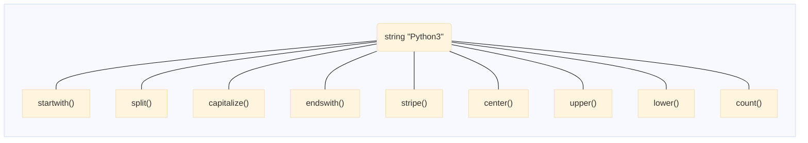
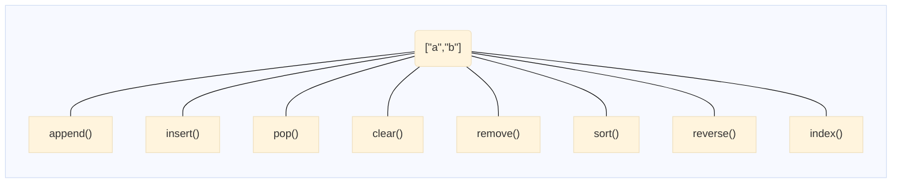

# 파이썬 기본 문법 복습

목차
- [파이썬 기본 문법 복습](#파이썬-기본-문법-복습)
- [기본 데이터 타입](#기본-데이터-타입)
- [변수](#변수)
- [자료구조](#자료구조)
- [인덱스, 슬라이싱](#인덱스-슬라이싱)
- [반복문](#반복문)
- [파이썬 함수](#파이썬-함수)
- [함수 호출](#함수-호출)
- [전역변수와 지역변수](#전역변수와-지역변수)
- [파이썬 모듈](#파이썬-모듈)
- [파이썬 패키지](#파이썬-패키지)
  - [패키지 만들기](#패키지-만들기)
- [파이썬 클래스](#파이썬-클래스)
  - [클래스를 왜 사용하나?](#클래스를-왜-사용하나)
  - [파이썬 타입](#파이썬-타입)
- [클래스와 인스턴스](#클래스와-인스턴스)
- [클래스와 메서드](#클래스와-메서드)
  - [붕어빵틀 클래스 매서드 넣기](#붕어빵틀-클래스-매서드-넣기)
  - [붕어빵틀 클래스에 메서드 넣기](#붕어빵틀-클래스에-메서드-넣기)
- [클래스와 self키워드](#클래스와-self키워드)
- [메서드 호출방식](#메서드-호출방식)
  - [새로운 메서드 호출방식](#새로운-메서드-호출방식)
- [클래스 생성자](#클래스-생성자)
  - [붕어빵을 굽는 방식](#붕어빵을-굽는-방식)
  - [생성자](#생성자)
  - [붕어빵틀 클래스 업데이트](#붕어빵틀-클래스-업데이트)


# 기본 데이터 타입
- int, float, string : 정수, 실수, 문자열
- type 함수 사용하면 타입 확인 가능
- 문자열은 ' 또는 " 둘다 사용가능

# 변수
- 자주 사용하는 값에 대한 이름표
- 변수 이름을 통해 변수에 접근 가능
  
  ```python
  변수명 = 3000
  변수명 * 30
  ```
- id(변수명)  64비트의 주소값 출력 (pc환경에 따라 다름)
``` python
a=2
a=4
print(a)
```
> a는 처음에 2를 가리키고 있다가, 두번째 라인을 수행하면서 4를 가리키게 된다.
> 2는 사용하지 않게 되므로 파이썬 가비지 콜렉터가 2는 자동으로 정리한다.


# 자료구조
- 리스트 [1,2,3] 순서있고 수정가능
- 튜플 (1,2,3) 순서가있고 수정 불가
- 딕셔너리 {"사과":2000,"배":3000} 순서가 없고 수정이 가능

# 인덱스, 슬라이싱
아이스크림 = ["구구콘","메로나","비비빅"]
print[0]    # 인덱스
print[0:2]  # 슬라이스  0부터 1까지 2번 인덱스 위치까지이므로 1까지만 해당

# 반복문
- for 또는 while 문으로 생성가능
 
```py
 for in 리스트:
    수행할 문장1
    수행할 문장2
```    

```py
카트=['과자','음료수','과일']
for i in 카트:
    print(i)
```    
```py
num = 0
while num < 5:
    print(num)
    num = num + 1
```
# 파이썬 함수
```py
def 함수이름(인자):
    코드

def sum(p1,p2,p3):
    return p1+p2+p3

def 별찍기():
    print('*'*30)
    print(' ')
    print('*'*30)

```
- 변수: 값에 대한 이름표
- 함수: 어떤 코드에 대한 이름표

# 함수 호출
- 호출 과정에 대한 이해 필요
- mysum은 주소이므로 괄호를 뒤에 붙여주고 인자 값을 넣어준다.
- argument 호출시 넣는 값 또는 변수
- parameter 함수의 정의에 사용되는 변수명
- 함수가 호출되면 함수의 주소로 찾아간다
- a와 b 변수가 생성이 되고 ret 변수에 7이 할당된다.
- return 함수가
```py
def mysum(a,b):

    ret = a + b
    return ret

ret1 = mysum(3,4)
```

# 전역변수와 지역변수
- 전역변수: 
  - 함수 바깥에 정의한 변수
  - 특정 파이썬 파일에서 정의된 변수
- 지역변수
  - 함수 내에서 정의된 변수
  - 함수가 호출된 그 순간에만 존재
- LEGB 규칙
  - Local
  - Enclosing
  - Global
  - Built-In: open, range 등 파이썬 내장함수 의미

# 파이썬 모듈
    - 파이썬 소스코드 파일을 모듈이라고 함
    - csv.py 가 있을 때 csv 모듈이라고 함
    - os.py는 os 모듈이라고 함
    - mymod.py 작성하면 mymod 모듈이라고 부른다
    - 아래 코드를 모두 사용할 수 있다.
    - 
```python
# Code                   # 사용법
import mymod             mymod.hap(3,4)
from mymod import hap    hap(3,4)
from mymod import *      hap(3,4)
import mymod as mm       mm.hap(3,4)
```

# 파이썬 패키지
- 모듈: 파이썬 파일. 보통 단일 파일 (csv.py)
- 패키지: 
  - 모듈의 규모가 커져서 디렉토리에 여러 파이썬 모듈이 있는 구조
  - multimedia 패키지
 

## 패키지 만들기
- multimedia라는 이름으로 디렉토리 생성
  - __init__.py (빈파일)
  - video.py
  - audio.py
```py
# mkdir multimedia

# __init__.py
(빈파일)

# video.py
def play_video():
  print("play video")

# audio.py
def play_audio():
  print("play audio")
```
- 사용법
```py
# 함수를 그냥 사용하는 경우
from multimedia.video import *
from multimedia.audio import *
play_video()
play_audio()

# alias를 지정하여 사용하는 경우
import multimedia.video as mv
import multimedia.audio as ma

mv.play_video()
ma.play_audio()

# alias 흔히 사용하는 예제
import matplot.pyplot as plt
plt.plot()

````

# 파이썬 클래스
- 파이썬 프로그래밍의 끝판왕
- 사용자만의 타입을 만들기 위해 사용
  - 기본 데이타 타입
    - 정수
    - 실수
    - 문자열
  - 자료구조
    - 리스트
    - 튜플
    - 딕셔너리

## 클래스를 왜 사용하나?
- 은행에서 고객 정보를 저장하는 타입(Customer)   
   
항목 | 값
-- | --
이름|홍길동
잔고|10,000
계좌번호|111-22-33333

- 서점에서 도서정보를 저장하는 타입(Book)
  
항목 | 값
-- | --
제목|파이썬을 활용한 비트코인 자동매매
페이지|424
가격|12,000
ISBN|967I8451223

## 파이썬 타입
- 데이터와 데이터를 처리하는 함수(메서드)
- c언어의 경우 절차지향형 프로그램
- 프로그래밍의 패러다임으로 클래스 이해
- 문자열 예제의 경우 다음과 같다.
  - 문자열이 있고 문자열을 제어하기 위한 메서드로 구성







# 클래스와 인스턴스
- 파이썬 클래스 정의하기
  - 사용자 정의 타입 만들기
  - 클래스가 정의되면 메모리에 공간이 할당되고 
    이를 클래스 이름으로 바인딩
  - 클래스가 정의됐다면 해당 타입의 인스턴스(객체)를 생성가능
    - 붕어빵 틀이 있다면 이를 통해 붕어빵 굽기 가능
    - 자동차를 만드는 설계도가 있다면 이를 통해 자동차 생산가능
    - 인스턴스가 생성되면 별도의 메모리공간 할당
  - 객체 공간의 값에 접근하기
    - 객체에 점(.)을 찍으면 객체 공간에 접근 가능
    - 객체 공간에 있는 변수를 속성(property)라고 함
```py
class 붕어빵틀:
  pass

내빵 = 붕어빵틀()
너빵 = 붕어빵틀()

내빵.앙꼬="딸기맛" // 속성(property)
너빵.앙꼬="초코맛" //

print(내빵.앙꼬)
print(너빵.앙꼬)
```

# 클래스와 메서드
- 클래스는 설계도(BluePrint)
- 클래스는 함수를 포함할 수 있음
  + 클래스 안에 정의된 함수를 메스드라고 부름
  + 클래스의 동작(Behavior)을 표현함
- 객체에는 데이터가 저장됨
  + 속성(Proprioty)

- 수퍼마리오 예제
  + 점프
  + 앞으로 이동
  + 뒤로 이동
  + 공격 

## 붕어빵틀 클래스 매서드 넣기  
- 기존 코드는 직접 객체에 접근하여 앙꼬를 넣었음
- 앙꼬 넣기 메서드 추가하기
  + 클래스에 들여쓰기 후 메서드 정의
    * 첫번째 인자는 어떤 붕어빵인지를 바인딩하는 변수
    * 두번째 인자는 붕어빵에 넣을 앙꼬를 바인딩하는 변수
  + 메소드는 클래스 공간의 이름 공간에 저장됨

```py
class 붕어빵틀:
  def 앙꼬넣기(어떤빵, 앙꼬):
    어떤빵.앙꼬=앙꼬

내빵 = 붕어빵틀()    

```

## 붕어빵틀 클래스에 메서드 넣기
- 앙꼬넣기 메서드 호출
  + 클래스 이름에 점을 찍으면 클래스 공간에 접근을 의미함
  + 클래스 이름에 점을 찍고 메스드 접근 후 호출가능
    * 메서드 호출시 ()를 붙여줌
    * 인자 갯수메 맞춰 파라미터 전달해주기
```py
class 붕어빵틀:
  def 앙꼬넣기(어떤빵, 앙꼬):
    어떤빵.앙꼬=앙꼬

내빵=붕어빵틀()

# 메서드 호출하기
붕어빵틀.앙꼬넣기(내빵, "딸기맛")
```
# 클래스와 self키워드
- 클래스에 정의된 함수를 메서드라고 부름
- 메스드의 클래스 공간에 저장됨
  + 메서드는 여러 객체에 의해 공유됨
- 메서드의 첫번째 인자는 메서드가 호출될 때 어떤 객체에 데이터를 저장하거나 또는 데이터에 접근하는지를 알려주는 역할을 하게 됨  
- 메서드의 첫번째 인자의 변수이름으로 관례적으로 self를 사용하자

```python
class 붕어빵틀:
  def 앙꼬넣기(어떤빵, 앙꼬):
    어떤빵.앙꼬=앙꼬

# 객체를 만들었으면 해당 객체를 가리키는 지정자가 필요:self
class 붕어빵틀:
  def 앙꼬넣기(self, 앙꼬):
    self.앙꼬=앙꼬
```

# 메서드 호출방식
- 메서드는 클래스 공간에 저장되고 데이터는 각 객체 공간에 저장된다
  + 클래스 공간에 저장된 메서드는 여러 객체에 의해 호출됨
  + 메서드가 호출될 때 첫번째 인자인 self 데이터가 저장된 객체를 바인딩함

```python
class 붕어빵틀:
  def 앙꼬넣기(self, 앙꼬):
    self.앙꼬=앙꼬
내빵=붕어빵틀()
붕어빵틀.앙꼬넣기(내빵,"딸기맛")    

```

## 새로운 메서드 호출방식
- 객체.메서드(인자1,인자2,,,)
  + 객체.메서드(...) 호출방식은 파이썬 인터프리터에 의해 자동으로
    클래스.메서드(객체, ...)으로 변경됨
  + 객체.메서드(...) 호출 방식은 self 자리에 값을 전달할 필요가 없음
    * 파이썬 인터프리터에 의해 자동으로 전달됨

```python
class 붕어빵틀:
  def 앙꼬넣기(self, 앙꼬):
    self.앙꼬넣기=앙꼬

내빵=붕어빵틀()

# 붕어빵 앙꼬넣기(내빵, "딸기맛")
# 아래와 같이 코딩하면 자동으로 위와 같이 변경해줌
내빵.앙꼬넣기("딸기맛")


# 리스트 예제
a=[1,2,3]   # list클래스의 객체 생성
a.append(4) # list클래스의 정의된 append 메서드를 a 객체에 대해 호출

# list.append(a, 4) # 원래는 이렇게

b="hello"  # b는 문자열 클래스의 객체
b.upper()  # 문자열 클래스의 upper 메서드 호출(b객체에 대해서)

# str.upper(b)  #원래는 이렇게

```

# 클래스 생성자
## 붕어빵을 굽는 방식
1. 붕어빵 틀로부터 먼저 붕어빵을 굽는다.
2. 구어진 붕어빵에 앙꼬를 넣는다 (메서드호출)

```python
class 붕어빵틀:
  def 앙꼬넣기(self, 앙꼬):
    self.앙꼬=앙꼬

내빵=붕어빵틀()
내빵.앙꼬넣기("딸기맛")

```

## 생성자
- 클래스로부터 객체가 생성될 때 파이썬 인터프리터에 의해 자동으로 호출되는 특별한 메서드
  + 프로그래머가 명시적으로 호출하는 것이 아님. 
  + 인터프리터에 의해 호출
  메모리에 생성된 객체 공간에 데이터를 넣거나 초기화 목적으로 사용됨
  + __init__ 이라는 특별한 이름을 가진
  + 첫번째 인자로 self를 사용함

```python
class 붕어빵틀:
  def __init__(self):  # 어떤 객체를 초기화 할 것인가?
    print("붕엉빵 잘 구워짐")
내빵=붕어빵()    
```

## 붕어빵틀 클래스 업데이트
- 기존에 앙꼬넣기의 역할은 붕어빵이 구워질 때 앙꼬를 넣는 것
- 객체를 생성할 때 바로 초기화하고 싶다

```python
class 붕어빵틀:
  def __init__(self, 앙꼬):
    self.앙꼬=앙꼬

내빵=붕어빵틀() #에러가 발생
# TypeError: __init__() missing 1 required positional argument: "앙꼬"

내빵=붕어빵틀("딸기맛") # 정상 처리됨
print(내빵.앙꼬)

```